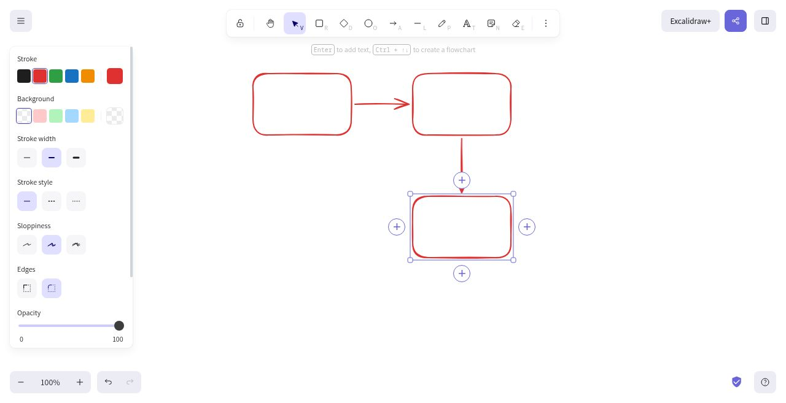
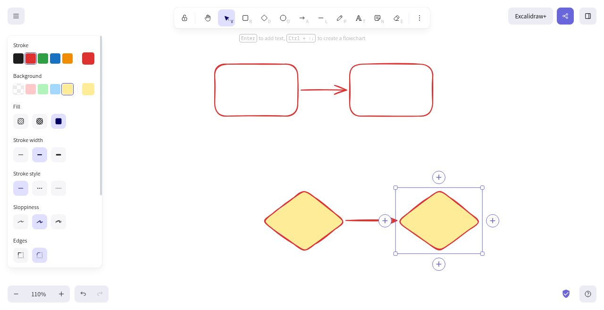

# Contextual flowchart plus buttons

Select one unlocked rectangle or diamond with the selection tool. Four small plus buttons appear outside its sides. Click one (or focus it and press Enter or Space) to add and connect the next shape in that direction.

The successor is selected immediately, so Enter can add a label and another plus can extend the flow. Its shape type, dimensions, and style come from the selected shape. Placement, elbow-arrow binding, frame membership, and undo capture reuse the existing keyboard flowchart engine.

Controls are hidden during text editing, drawing, dragging, resizing, rotation, keyboard flowchart previews, menus, dialogs, view mode, and multi-selection. Their size and gap stay constant in screen pixels while their anchor positions follow the scene's zoom and pan.

## Browser evidence

These screenshots were captured from the running editor while using the actual buttons; they contain only locally created test diagrams.



The new rectangles inherit the red stroke. Undo removes the lower node and its connector together; redo restores both.



The new diamond inherits the yellow solid fill and red stroke. The browser also verified creation after panning and native keyboard activation with Enter and Space. The editor's shortcuts do not intercept keys on focused plus buttons.

## Regression checks

```sh
yarn test:app --run packages/excalidraw/tests/flowchartPlusButtons.test.tsx \
  packages/element/tests/flowchart.test.tsx \
  packages/element/src/__tests__/flowchart.test.ts
yarn test:typecheck
yarn test:update
```

The new suite covers all four directions for both supported shapes, inherited styles, reciprocal bindings, selection, unsupported shape types, locked and view-mode restrictions, multi-selection, zoom/pan/container offsets, atomic undo/redo, cancellation of keyboard previews, and keyboard event isolation.

The app's same-origin self-embedding guard is removed as requested, allowing the editor to render in preview frames.
