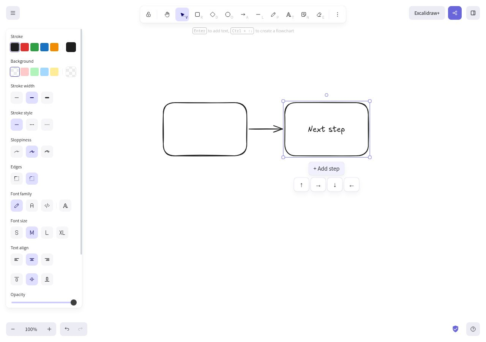
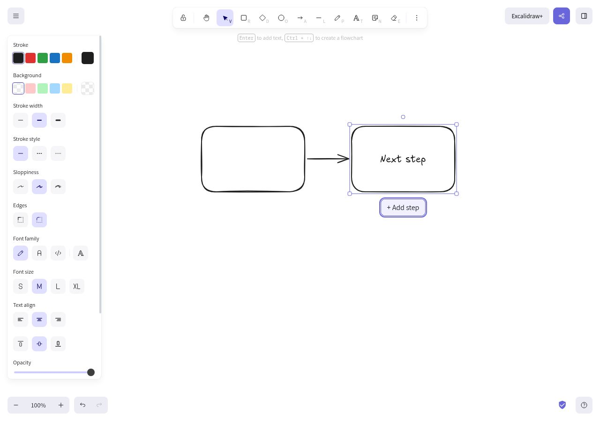

# Contextual flowchart Add step

Select a single unlocked rectangle or diamond, click **Add step**, then choose one of the four directions. The editor creates and selects a same-type successor with inherited styling and a bound elbow arrow. Press Enter to label the new step. Undo/redo treats the successor and its connector as one operation.

The picker uses native, labeled buttons with visible keyboard focus. Escape, an outside pointer press, or moving focus outside closes it without modifying the scene. The action is hidden during text editing, dragging, resizing, rotation, view mode, zen mode, and keyboard flowchart creation.

These screenshots were captured from the actual running editor with a 1280×900 browser viewport. They contain only synthetic example shapes and labels.

